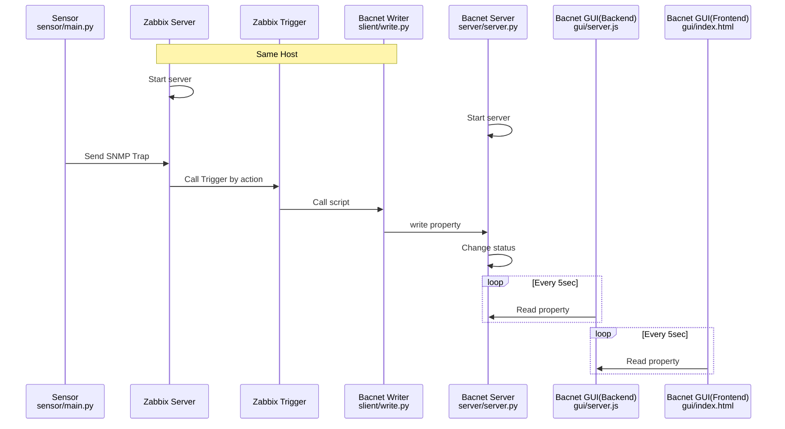

# zabbix-bacnet

```mermaid
sequenceDiagram
participant S as Sensor<br>sensor/main.py
participant Zs as Zabbix Server
participant Zt as Zabbix Trigger
participant Bw as Bacnet Writer<br>slient/write.py
participant Bs as Bacnet Server<br>server/server.py
participant Gb as Bacnet GUI(Backend)<br>gui/server.js
participant Gf as Bacnet GUI(Frontend)<br>gui/index.html

Note over Zs, Bw: Same Host

Zs ->> Zs: Start server
Bs ->> Bs: Start server

S ->> Zs: Send SNMP Trap
Zs ->> Zt: Call Trigger by action
Zt ->> Bw: Call script
Bw ->> Bs: write property
Bs ->> Bs: Change status
loop Every 5sec
    Gb ->> Bs: Read property
end
loop Every 5sec
    Gf ->> Gb: Read property
end
```

# for debug

- client/read.py
  - read-property for BACnet
- client/write.py
  - write-property for BACnet
